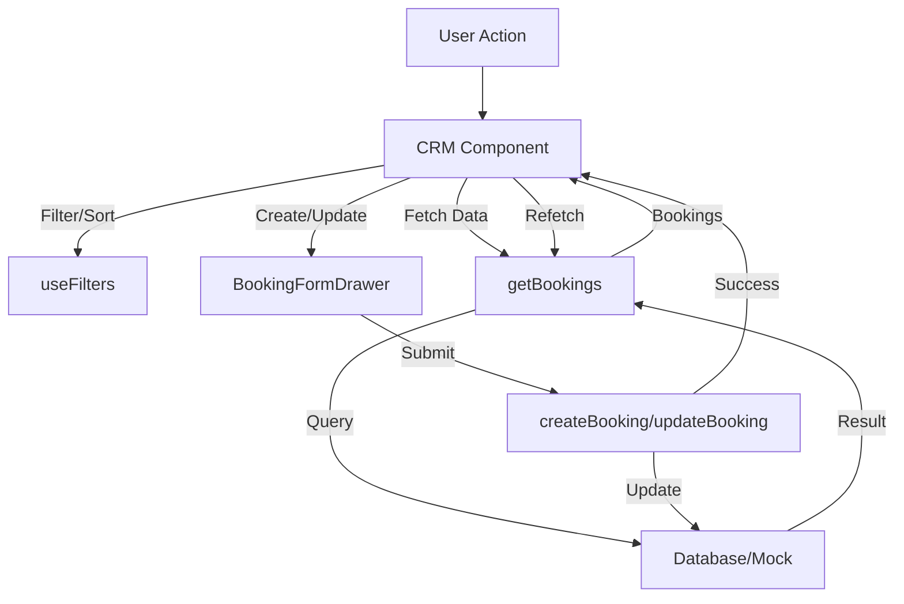

# CRM Module Documentation

## Overview
The CRM module provides a comprehensive interface for managing customer bookings. It supports multiple views (Table, Calendar, Kanban), advanced filtering, and detailed booking management.

## Architecture

### Components
- **CRM (Container)**: Manages global state (view, filters, data) and orchestrates sub-components.
- **Views**:
    - `BookingTable`: List view with pagination and sorting.
    - `CalendarView`: Month/Week/Day calendar visualization.
    - `KanbanBoard`: Status-based card layout.
- **Controls**:
    - `Filters`: Search, status/service filters, and dynamic custom filters.
    - `ViewToggle`: Switcher for main views.
- **Drawers/Modals**:
    - `BookingDetailsDrawer`: Read-only view of booking details with edit/delete actions.
    - `BookingFormDrawer`: Form for creating and editing bookings.
    - `DeleteConfirmationModal`: Safety check before deletion.

### State Management
- **Local State**: `CRM.tsx` holds the source of truth for UI state.
- **Data Fetching**: Server Actions (`actions/bookings.ts`) are called via `useEffect` and event handlers.
- **Filtering**: `useFilters` hook manages filter criteria.

## Data Flow

## User Flows

### Creating a Booking
1. User clicks "New Booking".
2. `BookingFormDrawer` opens.
3. User fills details and submits.
4. `createBooking` action is called.
5. On success, drawer closes and list refreshes.

### Managing a Booking
1. User clicks a booking in any view.
2. `BookingDetailsDrawer` opens.
3. User can:
    - **Edit**: Opens `BookingFormDrawer` with pre-filled data.
    - **Delete**: Opens `DeleteConfirmationModal`.

## Future Enhancements
- **Drag-and-Drop Kanban**: Implement `dnd-kit` for status updates.
- **Full Calendar Fetching**: Optimize calendar to fetch date ranges instead of paginated lists.
- **Real-time Updates**: Integrate websockets or polling for team collaboration.
